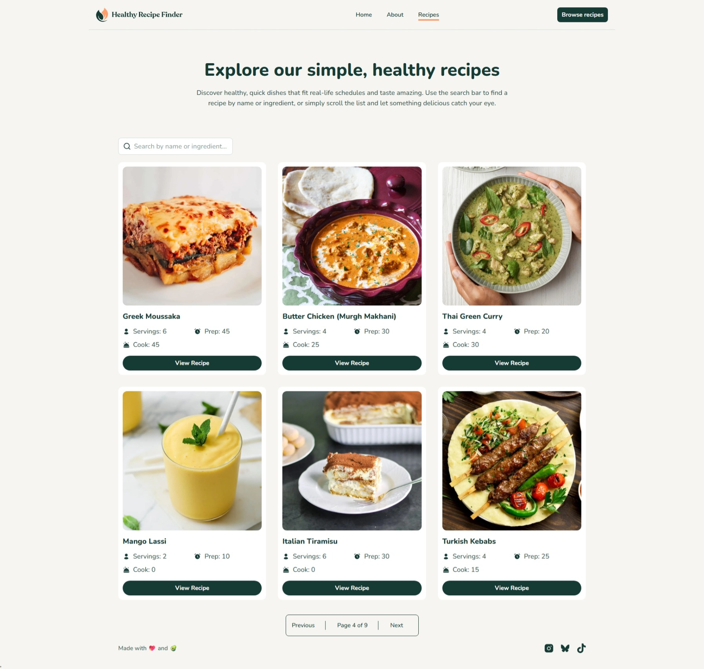
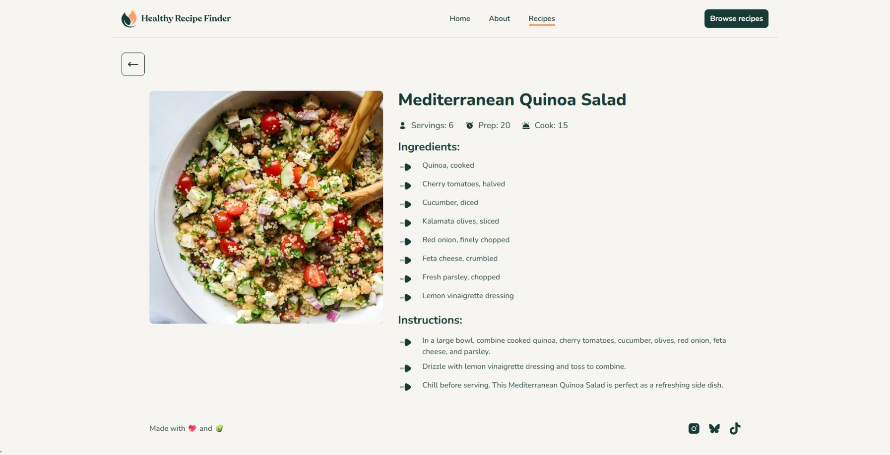
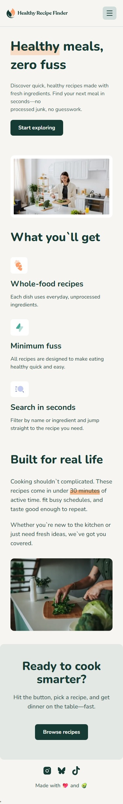

# Recipe Finder
- Recipe Finder is a responsive web application that allows users to discover and explore healthy-inspired recipes through a clean interface. Users can browse recipes, search by name or ingredient, and view detailed cooking information, including ingredients, instructions and more. The project was built with React, Tailwind CSS, and the DummyJSON API.

## Screenshots
### Home

### About

### Recipes

### Recipe Details Page

### Mobile View

## Live Demo
    https://recipe-finder-nine-indol.vercel.app/

## Features
- Explore the Home, About, Recipes, and Recipe Details pages.
- Search recipes by name or ingredient.
- Browse recipes with responsive pagination.
- Responsive interface optimized for mobile and desktop devices.
- Loading and error states for a better user experience while fetching data.

## Built With
- React
- React Router
- Tailwind CSS
- JavaScript
- Vite
- DummyJSON API
- Lucide React Icons

## Author
- GitHub: [Salima-Laidi](https://github.com/Salima-Laidi)